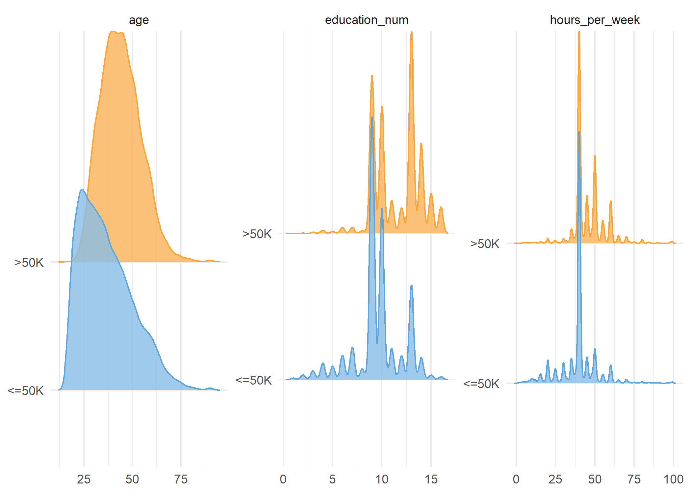

```{r setup, include=FALSE}
knitr::opts_chunk$set(echo = FALSE)
library(knitr)
library(kableExtra)
library(tidyverse)
```

```{r predictor-distributions, echo=FALSE}

```

```{r predictor-distributions2, echo=FALSE, message=FALSE}
df <- read_csv("../results/num_feat_summary.csv")
knitr::kable(df) %>%
  kableExtra::kable_styling(c("hover", "condensed"))
```

```{r predictor-distributions3, echo=FALSE, message=FALSE}
df <- read_csv("../results/cat_feat_summary.csv")
knitr::kable(df) %>%
  kableExtra::kable_styling(bootstrap_options = c("hover", "condensed"))
```