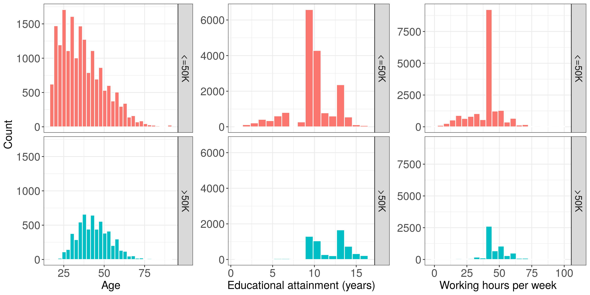

<style>
body {
text-align: justify}
</style>

```{r setup, include=FALSE}
knitr::opts_chunk$set(echo = FALSE)
library(knitr)
library(kableExtra)
library(tidyverse)
```

```{r read-ins, echo=FALSE, message=FALSE}
grid_search <- read_csv("../results/grid_search_summary.csv") %>%
  mutate(`Validation Score` = round(`Validation Score`, 3),
         `Mean Fit Time` = round(`Mean Fit Time`, 3),
         `Mean Score Time` = round(`Mean Score Time`, 3)) %>%
  rename("Mean Predict Time" = `Mean Fit Time`) %>%
  select(-`Mean Test Score`, -classifier_temp)

lr_pos <- read_csv("../results/pos_features.csv")
lr_neg <- read_csv("../results/neg_features.csv")
ada <- read_csv("../results/sig_features.csv")

positive_top_2 <- lr_pos %>% select(Feature) %>% slice(1:2)
positive_3 <- lr_pos %>% select(Feature) %>% slice(3)

negative_top_2 <- lr_neg %>% select(Feature) %>% slice(1:2)
negative_3 <- lr_neg %>% select(Feature) %>% slice(3)

ada_first <- ada %>% select(Feature) %>% slice(1)
ada_second <- ada %>% select(Feature) %>% slice(2)

```

# Summary
This analysis attempted to determine the most important features when predicting a yearly salary of more than 50,000 USD. A logistic regression model and AdaBoost model were trained in an effort to extract feature importance. The models did not perform exceedingly well, with scores in the low 80s, but performed similarly to random forest and support vector machine (SVM) models. The logistic regression model’s most important features in predicting a yearly salary of greater than 50,000 USD were `marital_status_Married-AF-spouse` and `marital_status_Married-civ-spouse` while the most important features in predicting a yearly salary of less than 50,000 USD were `occupation-private-house-serv` and `workclass-without-pay`. The Adaboost model identified `education-num` and `age` as the most important features in classification.

# Introduction
Being able to understand what demographic characteristics best predict income level can aid in guiding transformative policy decisions and drive societal change. Recent reports indicate that while the gender wage gap is slowly shrinking [@cbc_wage], level of education attained continues to be an important metric when predicting salary [@cbc_education]. If these reports are accurate, one would expect education, but not gender, to be a good predictor of income level. However, it would be interesting to explore if the findings of these reports align with the economic environment around turn of the century.

This data analysis aims to determine which features best predict whether someone earned more than $50,000 per year around the turn of the century. 

# Method
### Data
The Adult dataset was provided to the UCI Machine Learning Repository by Ronny Kohavi and Barry Becker [@Dua] and can be found [here](https://archive.ics.uci.edu/ml/datasets/Adult). The data was extracted from the 1994 US Census. The training set can be found [here](https://archive.ics.uci.edu/ml/machine-learning-databases/adult/adult.data) and the test set can be found [here](https://archive.ics.uci.edu/ml/machine-learning-databases/adult/adult.test). The dataset is comprised of 14 features: six numerical features and eight categorical features. The numerical features were `age`, `fnlwgt`, `education-num`, `capital-gain`, `capital-loss`, and `hours-per-week`. The categorical features were `workclass`, `education`, `marital-status`, `occupation`, `relationship`, `race`, `sex`, and `native-country`. The target values were `>50K` and `<=50K` indicating whether or not income exceeds $50,000 per year. It is worth mentioning that `fnlwgt`, `capital-gain`, `capital-loss`, and `education` were excluded for the analysis. `Education` was excluded in favour of its numerical counterpart (`education-num`). The other features were omitted because it was unclear what they were measuring. Missing values were found in the `workclass`, `occupation`, and `native-country` columns. Rows with missing values were removed for the analysis. In addition, while `native-country` was originally comprised of 41 attributes, they were abstracted to be either `United-States` or `non-US`. 

### Analysis
With the goal of evaluating feature importance in predicting income, a logistic regression classifier and an AdaBoost classifier were chosen. Both classifiers generate feature importance metrics, allowing for feature interpretablity. Other classifiers (e.g. random forest, SVM) were chosen to comparatively demonstrate the robustness of the logistic regression and AdaBoost models. 

For binary classification, logistic regression assigns positives weights to features that best predict positive outcomes (`>50K`) and negative weights to features that best predict negative outcomes (`<=50K`). The larger the magnitude of the weight, the greater the influence is on the outcome. AdaBoost is an ensembling method that assigns a feature importance to each feature. This metric is always positive and sums to one. The larger the magnitude of the metric, the greater the importance of the feature to the overall model in predicting. Random forest classsifiers generally provide robust models but they are not easily interpretable. This classifier was included to allow for the comparison of a non-parametric model to the parametric models. The SVM classifier was included based on its robustness to non-linearly separable data. 

Prior to analysis, the features were pre-processed. The categorical and numerical features were transformed using scikit-learn's `OneHotEncoder`and `StandardScaler`, respectively. `OneHotEncoder` was executed without dropping the first column. Although this increased the complexity of the model, it allowed for sensible interpretation of the features.

A grid search with 10-fold cross-validation was conducted to determine the optimal hyperparameters. The following hyperparameters were selected for optimization: `solver` for `LogisticRegression`; `learning_rate` for `Adaboost`; `kernel`, `C`, and `gamma` for `SVM`; and `max_depth` for `RandomForest`.

Both Python and R programming languages were used in conjunction with the following packages: doctopt [@R_docopt; @py_docopt], requests [@requests], pandas[@mckinney-proc-scipy-2010], numpy [@oliphant2006guide], scikit-learn [@scikit-learn], feather-format [@feather-format], pyarrow[@pyarrow], feather [@R_feather], knitr [@knitr], tidyverse [@tidyverse], ggridges [@ggridges], ggthemes [@ggthemes], testthat [@testthat], gridExtra [@gridExtra], rlang [@rlang], and rmarkdown [@rmarkdown].

# Results & Discussion
To gain familiarity with the features at hand, exploratory data analysis was performed using the training data. With respect to the categorical feature `marital-status`, the proportion of those who were married was higher in the high-income class than in the low-income class. `Exec-managerial` was the most frequently occurring occupation followed by `Prof-speciality` in the high-income class. While `Adm-clerical`, `Other-service`, and `Craft-repair` were three of the most frequently occurring professions in the low-income class, no single occupation dominated. To get a better understanding of the numerical features in the dataset, their distributions were compared across income levels (red: `50K`, blue: `<= 50K`). With respect to age, the centers of the distributions were not aligned, suggesting that age might be a good predictor. With regard to education, the largest peak is located further to the right (i.e. more years spent in education) in the high-income class. Interestingly, across both income groups, a 40-hour workweek appeared to be the standard. However, it is worth noting that there is a second peak around 50 hours per week among the high earners.

</br>
```{r distribution, echo=FALSE, message=FALSE, fig.cap="Figure 1. Comparison of the distributions of numerical features between high and low income levels.", out.width = '80%'}

```
</br>
The validation scores from the four models were all similar to one another (within 0.1% difference). These values demonstrated the robustness of the linear regression and AdaBoost models. Moreover, the fit and predict times of the logistic regression classifier were much faster than those of other models. Once the optimal hyperparameters for the logistic regression and Adaboost models were chosen to be `solver = "saga"` and `learning_rate = 1`, respectively, the two optimized models were trained on the combined training and validation sets.

```{r grid search summary, echo=FALSE, message=FALSE}
kable(grid_search, caption="Table 1. Summary of hyperparameter optimization.") %>%
  kable_styling(bootstrap_options = c("condensed"), full_width = F) %>%
  row_spec(0, background = '#696969', color = 'white', align = 'c')
```

</br>
The top ten features that contribute to a positive or negative classification, as determined by the logistic regression model are listed below. The linear regression model suggests that the most important features in classifying an income of `>50K` are `r positive_top_2$Feature`, and `r positive_3$Feature`. Features that one would objectively expect to be predictive of a high salary including `education` and `occupation` of `Exec-managerial` were both in the top five. The most important features in classifying a salary of `<=50K` are `r positive_top_2$Feature` followed closely by `r positive_3$Feature`. `occupation` of `Other-service` and `Farming-fishing` in addition to `sex_Female` were also strong predictors of a lower salary.

</br>
```{r logistic regression positive, echo=FALSE, message=FALSE}
kable(lr_pos, caption="Table 2. Most important positive features determined by logistic regression.") %>%
  kable_styling(bootstrap_options = c("condensed"), full_width = F, position = 'float_left') %>%
  row_spec(0, background = '#696969', color = 'white', align = 'c')

kable(lr_neg, caption="Table 3. Most important negative features determined by logistic regression.") %>%
  kable_styling(bootstrap_options = c("condensed"), full_width = F, position = 'right')%>%
  row_spec(0, background = '#696969', color = 'white', align = 'c', )
```

</br>
In addition, the top features as determined by the Adaboost model can be found below. The AdaBoost model determined that the most significant feature in predicting salary is `r ada_first$Feature` followed closely by `r ada_second$Feature`. These two features taken together account for a large proportion of the model's predictive mechanism. Note that both `education-num` and `age` appear in the top ten most important positive features (target = `>50K`) determined by the logistic regression model.

</br>
```{r ada, echo=FALSE, message=FALSE}
kable(ada, caption="Table 4. Most important features determined by Adaboost.") %>%
  kable_styling(bootstrap_options = c("condensed"), full_width = F, position = 'center') %>%
  row_spec(0, background = '#696969', color = 'white', align = 'c')
```
</br>
Some elements of the data analysis pipeline require further discussion. The features `fnlwgt`, `capital-gain`, `capital-loss`, and `education-num` were dropped. However, it is worthwhile to address the possibility that some of these features could have been good predictors of income. Further improvements to the models could have been considered: a more comprehensive initial feature selection could have been conducted, numeric features could have been normalized instead of standardized, and the logistic regression model could have been made more robust by generating polynomial features - however, this would be at the expense of interpretability.

# Bibliography
