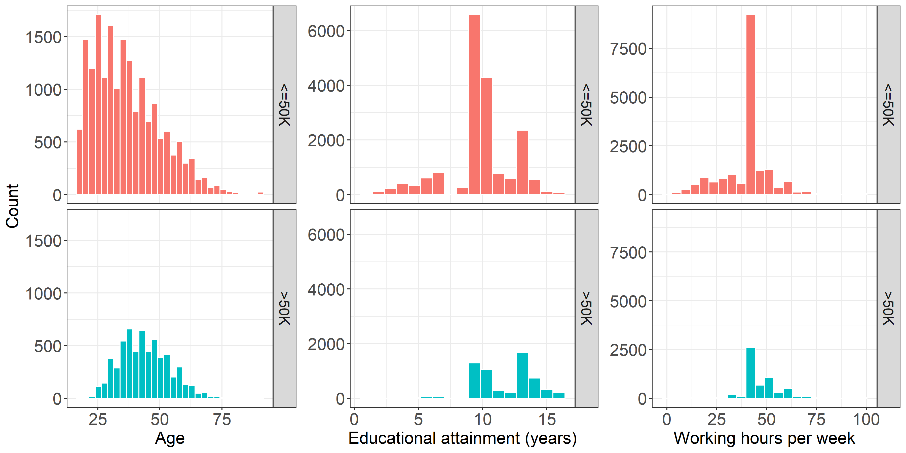

Income Level Predictor
================
Reiko Okamoto and Evhen Dytyniak
2020/01/31

  - [Summary](#summary)
  - [Introduction](#introduction)
  - [Method](#method)
      - [Data](#data)
      - [Analysis](#analysis)
  - [Results & Discussion](#results-discussion)
  - [Bibliography](#bibliography)

# Summary

This analysis attempted to determine the most important features when
predicting a yearly salary of more than 50,000 USD. A logistic
regression model and AdaBoost model were trained in an effort to extract
feature importance. The models did not perform exceedingly well, with
scores in the low 80s, but performed similarly to random forest and
support vector machine (SVM) models. The logistic regression model’s
most important features in predicting a yearly salary of greater than
50,000 USD were `marital_status_Married-AF-spouse` and
`marital_status_Married-civ-spouse` while the most important features in
predicting a yearly salary of less than 50,000 USD were
`occupation-private-house-serv` and `workclass-without-pay`. The
Adaboost model identified `education-num` and `age` as the most
important features in classification.

# Introduction

Being able to understand what demographic characteristics best predict
income level can aid in guiding transformative policy decisions and
drive societal change. Recent reports indicate that while the gender
wage gap is slowly shrinking (CBC 2017), level of education attained
continues to be an important metric when predicting salary (CBC 2016).
If these reports are accurate, one would expect education, but not
gender, to be a good predictor of income level. However, it would be
interesting to explore if the findings of these reports align with the
economic environment around turn of the century.

This data analysis aims to determine which features best predict whether
someone earned more than $50,000 per year around the turn of the
century.

# Method

### Data

The Adult dataset was provided to the UCI Machine Learning Repository by
Ronny Kohavi and Barry Becker (Dua and Graff 2017) and can be found
[here](https://archive.ics.uci.edu/ml/datasets/Adult). The data was
extracted from the 1994 US Census. The training set can be found
[here](https://archive.ics.uci.edu/ml/machine-learning-databases/adult/adult.data)
and the test set can be found
[here](https://archive.ics.uci.edu/ml/machine-learning-databases/adult/adult.test).
The dataset is comprised of 14 features: six numerical features and
eight categorical features. The numerical features were `age`, `fnlwgt`,
`education-num`, `capital-gain`, `capital-loss`, and `hours-per-week`.
The categorical features were `workclass`, `education`,
`marital-status`, `occupation`, `relationship`, `race`, `sex`, and
`native-country`. The target values were `>50K` and `<=50K` indicating
whether or not income exceeds $50,000 per year. It is worth mentioning
that `fnlwgt`, `capital-gain`, `capital-loss`, and `education` were
excluded for the analysis. `Education` was excluded in favour of its
numerical counterpart (`education-num`). The other features were omitted
because it was unclear what they were measuring. Missing values were
found in the `workclass`, `occupation`, and `native-country` columns.
Rows with missing values were removed for the analysis. In addition,
while `native-country` was originally comprised of 41 attributes, they
were abstracted to be either `United-States` or `non-US`.

### Analysis

With the goal of evaluating feature importance in predicting income, a
logistic regression classifier and an AdaBoost classifier were chosen.
Both classifiers generate feature importance metrics, allowing for
feature interpretablity. Other classifiers (e.g. random forest, SVM)
were chosen to comparatively demonstrate the robustness of the logistic
regression and AdaBoost models.

For binary classification, logistic regression assigns positives weights
to features that best predict positive outcomes (`>50K`) and negative
weights to features that best predict negative outcomes (`<=50K`). The
larger the magnitude of the weight, the greater the influence is on the
outcome. AdaBoost is an ensembling method that assigns a feature
importance to each feature. This metric is always positive and sums to
one. The larger the magnitude of the metric, the greater the importance
of the feature to the overall model in predicting. Random forest
classsifiers generally provide robust models but they are not easily
interpretable. This classifier was included to allow for the comparison
of a non-parametric model to the parametric models. The SVM classifier
was included based on its robustness to non-linearly separable data.

Prior to analysis, the features were pre-processed. The categorical and
numerical features were transformed using scikit-learn’s
`OneHotEncoder`and `StandardScaler`, respectively. `OneHotEncoder` was
executed without dropping the first column. Although this increased the
complexity of the model, it allowed for sensible interpretation of the
features.

A grid search with 10-fold cross-validation was conducted to determine
the optimal hyperparameters. The following hyperparameters were selected
for optimization: `solver` for `LogisticRegression`; `learning_rate` for
`Adaboost`; `kernel`, `C`, and `gamma` for `SVM`; and `max_depth` for
`RandomForest`.

Both Python and R programming languages were used in conjunction with
the following packages: doctopt (de Jonge 2018; Keleshev 2014), requests
(Reitz 2019), pandas(McKinney 2010), numpy (Oliphant 2006), scikit-learn
(Pedregosa et al. 2011), feather-format (*Feather* 2019),
pyarrow(Developers 2019), feather (Wickham 2019c), knitr (Xie 2014),
tidyverse (Wickham 2019b), ggridges (Wilke 2020), ggthemes (Arnold
2019), testthat (Wickham 2019a), gridExtra (Auguie 2017), rlang (Henry
2020), and rmarkdown (Allaire et al. 2020).

# Results & Discussion

To gain familiarity with the features at hand, exploratory data analysis
was performed using the training data. With respect to the categorical
feature `marital-status`, the proportion of those who were married was
higher in the high-income class than in the low-income class.
`Exec-managerial` was the most frequently occurring occupation followed
by `Prof-speciality` in the high-income class. While `Adm-clerical`,
`Other-service`, and `Craft-repair` were three of the most frequently
occurring professions in the low-income class, no single occupation
dominated. To get a better understanding of the numerical features in
the dataset, their distributions were compared across income levels
(red: `50K`, blue: `<= 50K`). With respect to age, the centers of the
distributions were not aligned, suggesting that age might be a good
predictor. With regard to education, the largest peak is located further
to the right (i.e. more years spent in education) in the high-income
class. Interestingly, across both income groups, a 40-hour workweek
appeared to be the standard. However, it is worth noting that there is a
second peak around 50 hours per week among the high earners.

 

Figure 1. Comparison of the distributions of numerical features between
high and low income levels.

  The validation scores from the four models were all similar to one
another (within 0.1% difference). These values demonstrated the
robustness of the linear regression and AdaBoost models. Moreover, the
fit and predict times of the logistic regression classifier were much
faster than those of other models. Once the optimal hyperparameters for
the logistic regression and Adaboost models were chosen to be `solver =
"saga"` and `learning_rate = 1`, respectively, the two optimized models
were trained on the combined training and validation sets.

<table class="table table-condensed" style="width: auto !important; margin-left: auto; margin-right: auto;">

<caption>

Table 1. Summary of hyperparameter optimization.

</caption>

<thead>

<tr>

<th style="text-align:left;color: white !important;background-color: #696969 !important;text-align: center;">

Classifier

</th>

<th style="text-align:right;color: white !important;background-color: #696969 !important;text-align: center;">

Validation Score

</th>

<th style="text-align:right;color: white !important;background-color: #696969 !important;text-align: center;">

Mean Predict Time

</th>

<th style="text-align:right;color: white !important;background-color: #696969 !important;text-align: center;">

Mean Score Time

</th>

<th style="text-align:left;color: white !important;background-color: #696969 !important;text-align: center;">

Optimum Hyperparameters

</th>

</tr>

</thead>

<tbody>

<tr>

<td style="text-align:left;">

Random Forest

</td>

<td style="text-align:right;">

0.839

</td>

<td style="text-align:right;">

12.960

</td>

<td style="text-align:right;">

0.111

</td>

<td style="text-align:left;">

{’classifier\_\_max\_depth’: 15}

</td>

</tr>

<tr>

<td style="text-align:left;">

Ada Boost

</td>

<td style="text-align:right;">

0.835

</td>

<td style="text-align:right;">

3.687

</td>

<td style="text-align:right;">

0.079

</td>

<td style="text-align:left;">

{’classifier\_\_learning\_rate’: 1}

</td>

</tr>

<tr>

<td style="text-align:left;">

Support Vector Machines

</td>

<td style="text-align:right;">

0.834

</td>

<td style="text-align:right;">

36.442

</td>

<td style="text-align:right;">

2.248

</td>

<td style="text-align:left;">

{’classifier\_\_C’: 1, ’classifier\_\_gamma’: ‘scale’,
’classifier\_\_kernel’: ‘rbf’}

</td>

</tr>

<tr>

<td style="text-align:left;">

Logistic Regression

</td>

<td style="text-align:right;">

0.829

</td>

<td style="text-align:right;">

1.255

</td>

<td style="text-align:right;">

0.019

</td>

<td style="text-align:left;">

{’classifier\_\_solver’: ‘saga’}

</td>

</tr>

</tbody>

</table>

  The top ten features that contribute to a positive or negative
classification, as determined by the logistic regression model are
listed below. The linear regression model suggests that the most
important features in classifying an income of `>50K` are
marital\_status\_Married-AF-spouse, marital\_status\_Married-civ-spouse,
and relationship\_Wife. Features that one would objectively expect to be
predictive of a high salary including `education` and `occupation` of
`Exec-managerial` were both in the top five. The most important features
in classifying a salary of `<=50K` are
marital\_status\_Married-AF-spouse, marital\_status\_Married-civ-spouse
followed closely by relationship\_Wife. `occupation` of `Other-service`
and `Farming-fishing` in addition to `sex_Female` were also strong
predictors of a lower salary.

 

<table class="table table-condensed" style="width: auto !important; float: left; margin-right: 10px;">

<caption>

Table 2. Most important positive features determined by logistic
regression.

</caption>

<thead>

<tr>

<th style="text-align:left;color: white !important;background-color: #696969 !important;text-align: center;">

Feature

</th>

<th style="text-align:right;color: white !important;background-color: #696969 !important;text-align: center;">

Weight

</th>

</tr>

</thead>

<tbody>

<tr>

<td style="text-align:left;">

marital\_status\_Married-AF-spouse

</td>

<td style="text-align:right;">

1.31

</td>

</tr>

<tr>

<td style="text-align:left;">

marital\_status\_Married-civ-spouse

</td>

<td style="text-align:right;">

1.26

</td>

</tr>

<tr>

<td style="text-align:left;">

relationship\_Wife

</td>

<td style="text-align:right;">

1.14

</td>

</tr>

<tr>

<td style="text-align:left;">

occupation\_Exec-managerial

</td>

<td style="text-align:right;">

0.91

</td>

</tr>

<tr>

<td style="text-align:left;">

education\_num

</td>

<td style="text-align:right;">

0.76

</td>

</tr>

<tr>

<td style="text-align:left;">

occupation\_Prof-specialty

</td>

<td style="text-align:right;">

0.69

</td>

</tr>

<tr>

<td style="text-align:left;">

occupation\_Tech-support

</td>

<td style="text-align:right;">

0.68

</td>

</tr>

<tr>

<td style="text-align:left;">

occupation\_Protective-serv

</td>

<td style="text-align:right;">

0.63

</td>

</tr>

<tr>

<td style="text-align:left;">

workclass\_Federal-gov

</td>

<td style="text-align:right;">

0.60

</td>

</tr>

<tr>

<td style="text-align:left;">

age

</td>

<td style="text-align:right;">

0.39

</td>

</tr>

</tbody>

</table>

<table class="table table-condensed" style="width: auto !important; margin-right: 0; margin-left: auto">

<caption>

Table 3. Most important negative features determined by logistic
regression.

</caption>

<thead>

<tr>

<th style="text-align:left;color: white !important;background-color: #696969 !important;text-align: center;">

Feature

</th>

<th style="text-align:right;color: white !important;background-color: #696969 !important;text-align: center;">

Weight

</th>

</tr>

</thead>

<tbody>

<tr>

<td style="text-align:left;">

occupation\_Priv-house-serv

</td>

<td style="text-align:right;">

\-1.42

</td>

</tr>

<tr>

<td style="text-align:left;">

workclass\_Without-pay

</td>

<td style="text-align:right;">

\-1.26

</td>

</tr>

<tr>

<td style="text-align:left;">

relationship\_Own-child

</td>

<td style="text-align:right;">

\-1.05

</td>

</tr>

<tr>

<td style="text-align:left;">

marital\_status\_Never-married

</td>

<td style="text-align:right;">

\-1.02

</td>

</tr>

<tr>

<td style="text-align:left;">

occupation\_Farming-fishing

</td>

<td style="text-align:right;">

\-0.86

</td>

</tr>

<tr>

<td style="text-align:left;">

occupation\_Other-service

</td>

<td style="text-align:right;">

\-0.81

</td>

</tr>

<tr>

<td style="text-align:left;">

sex\_Female

</td>

<td style="text-align:right;">

\-0.78

</td>

</tr>

<tr>

<td style="text-align:left;">

relationship\_Other-relative

</td>

<td style="text-align:right;">

\-0.65

</td>

</tr>

<tr>

<td style="text-align:left;">

marital\_status\_Separated

</td>

<td style="text-align:right;">

\-0.63

</td>

</tr>

<tr>

<td style="text-align:left;">

marital\_status\_Married-spouse-absent

</td>

<td style="text-align:right;">

\-0.62

</td>

</tr>

</tbody>

</table>

  In addition, the top features as determined by the Adaboost model
can be found below. The AdaBoost model determined that the most
significant feature in predicting salary is education\_num followed
closely by age. These two features taken together account for a large
proportion of the model’s predictive mechanism. Note that both
`education-num` and `age` appear in the top ten most important positive
features (target = `>50K`) determined by the logistic regression model.

 

<table class="table table-condensed" style="width: auto !important; margin-left: auto; margin-right: auto;">

<caption>

Table 4. Most important features determined by Adaboost.

</caption>

<thead>

<tr>

<th style="text-align:left;color: white !important;background-color: #696969 !important;text-align: center;">

Feature

</th>

<th style="text-align:right;color: white !important;background-color: #696969 !important;text-align: center;">

Importance

</th>

</tr>

</thead>

<tbody>

<tr>

<td style="text-align:left;">

education\_num

</td>

<td style="text-align:right;">

0.22

</td>

</tr>

<tr>

<td style="text-align:left;">

age

</td>

<td style="text-align:right;">

0.20

</td>

</tr>

<tr>

<td style="text-align:left;">

hours\_per\_week

</td>

<td style="text-align:right;">

0.06

</td>

</tr>

<tr>

<td style="text-align:left;">

sex\_Male

</td>

<td style="text-align:right;">

0.04

</td>

</tr>

<tr>

<td style="text-align:left;">

relationship\_Wife

</td>

<td style="text-align:right;">

0.04

</td>

</tr>

<tr>

<td style="text-align:left;">

occupation\_Sales

</td>

<td style="text-align:right;">

0.02

</td>

</tr>

<tr>

<td style="text-align:left;">

occupation\_Handlers-cleaners

</td>

<td style="text-align:right;">

0.02

</td>

</tr>

<tr>

<td style="text-align:left;">

occupation\_Other-service

</td>

<td style="text-align:right;">

0.02

</td>

</tr>

<tr>

<td style="text-align:left;">

occupation\_Priv-house-serv

</td>

<td style="text-align:right;">

0.02

</td>

</tr>

<tr>

<td style="text-align:left;">

occupation\_Prof-specialty

</td>

<td style="text-align:right;">

0.02

</td>

</tr>

</tbody>

</table>

  Some elements of the data analysis pipeline require further
discussion. The features `fnlwgt`, `capital-gain`, `capital-loss`, and
`education-num` were dropped. However, it is worthwhile to address the
possibility that some of these features could have been good predictors
of income. Further improvements to the models could have been
considered: a more comprehensive initial feature selection could have
been conducted, numeric features could have been normalized instead of
standardized, and the logistic regression model could have been made
more robust by generating polynomial features - however, this would be
at the expense of interpretability.

# Bibliography

Allaire, JJ, Yihui Xie, Jonathan McPherson, Javier Luraschi, Kevin
Ushey, Aron Atkins, Hadley Wickham, Joe Cheng, Winston Chang, and
Richard Iannone. 2020. *Rmarkdown: Dynamic Documents for R*.
<https://github.com/rstudio/rmarkdown>.

Arnold, Jeffrey B. 2019. *Ggthemes: Extra Themes, Scales and Geoms for
’Ggplot2’*. <https://CRAN.R-project.org/package=ggthemes>.

Auguie, Baptiste. 2017. *GridExtra: Miscellaneous Functions for "Grid"
Graphics*. <https://CRAN.R-project.org/package=gridExtra>.

CBC. 2016. “Higher Education Still Worth the Money, New Research
Suggests.” *CBC*, July.
<https://www.cbc.ca/news/business/university-college-degree-salary-1.3695254>.

———. 2017. “The Wage Gap Is Shrinking: Women Earned 87 Cents for Every
Dollar Earned by Men in 2018.” *CBC*, October.
<https://www.cbc.ca/news/business/statistics-canada-gender-wage-gap-1.5311454>.

de Jonge, Edwin. 2018. <https://CRAN.R-project.org/package=docopt>.

Developers, Apache Arrow. 2019. *Pyarrow: Python Library for Apache
Arrow*. <https://pypi.org/project/pyarrow/>.

Dua, Dheeru, and Casey Graff. 2017. “UCI Machine Learning Repository.”
University of California, Irvine, School of Information; Computer
Sciences. <http://archive.ics.uci.edu/ml>.

*Feather*. 2019. <https://github.com/wesm/feather/tree/master/python>.

Henry, Lionel. 2020. *Rlang: Functions for Base Types and Core R and
’Tidyverse’ Features*. <https://CRAN.R-project.org/package=rlang>.

Keleshev, Vladimir. 2014. <https://github.com/docopt/docopt>.

McKinney, Wes. 2010. “Data Structures for Statistical Computing in
Python.” In *Proceedings of the 9th Python in Science Conference*,
edited by Stéfan van der Walt and Jarrod Millman, 51–56.

Oliphant, Travis E. 2006. *A Guide to Numpy*. Vol. 1. Trelgol Publishing
USA.

Pedregosa, F., G. Varoquaux, A. Gramfort, V. Michel, B. Thirion, O.
Grisel, M. Blondel, et al. 2011. “Scikit-Learn: Machine Learning in
Python.” *Journal of Machine Learning Research* 12: 2825–30.

Reitz, Kenneth. 2019. *Requests: HTTP for Humans*.
<https://github.com/psf/requests>.

Wickham, Hadley. 2019a. *Testthat: Unit Testing for R*.
<https://CRAN.R-project.org/package=testthat>.

———. 2019b. *Tidyverse: Easily Install and Load the ’Tidyverse’*.
<https://CRAN.R-project.org/package=tidyverse>.

———. 2019c. <https://CRAN.R-project.org/package=feather>.

Wilke, Claus O. 2020. *Ggridges: Ridgeline Plots in ’Ggplot2’*.
<https://CRAN.R-project.org/package=ggridges>.

Xie, Yihui. 2014. “Knitr: A Comprehensive Tool for Reproducible Research
in R.” In *Implementing Reproducible Computational Research*, edited by
Victoria Stodden, Friedrich Leisch, and Roger D. Peng. Chapman;
Hall/CRC. <http://www.crcpress.com/product/isbn/9781466561595>.

